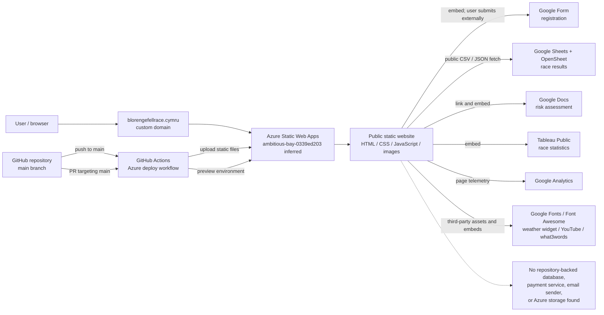

# Architecture

## Overview

The Blorenge Fell Race website is a static, browser-rendered site. Azure Static Web Apps serves HTML, CSS, JavaScript, and images directly from the repository root. There is no application server, API, database, or package build in this repository.

## Components

| Component | Location | Responsibility |
|---|---|---|
| Home | `index.html` | Current event summary, location, environmental/community content, weather and video embeds. |
| Information | `info.html` | Travel, kit, recce, race report, winner images, Tableau statistics. |
| Route | `route.html` | Route narrative, map/images, and Google Docs risk assessment. |
| Entry | `enter.html` | Embeds the external Google registration form. |
| Results | `result.html` | Fetches and renders current/historical public results from Google Sheets/OpenSheet. |
| Privacy | `privacy.html` | Public privacy statement and contact details. |
| Shared navigation/footer | `components/` | HTML fragments embedded into every page using iframes, with component CSS. |
| Styling | root `style*.css` plus component CSS | Layout, responsive breakpoints, tables, route, and winner-card styling. |
| Behaviour | `script.js` and inline scripts | Scrolling, analytics setup, registration iframe observation, results fetching/rendering, Tableau loading. |
| Media | `images/` | Logos, route/event images, maps, and winners. |
| Routing | `routes.json` | Rewrites all paths to `index.html` with HTTP 200. |

## Data ownership and flow

- Site content and images are committed to Git and deployed as public static assets.
- Registration is entered directly into a Google Form controlled outside this repository. The site never receives or stores the submitted form fields.
- Results JavaScript makes unauthenticated browser requests to public Google Sheet CSV endpoints and an OpenSheet JSON endpoint. Results availability therefore depends on those publications and their schemas.
- Tableau Public supplies race statistics. Google Analytics receives page telemetry from the browser.
- A public contact email address is exposed through `mailto:` links; no message passes through application code.
- No secret values are needed in the browser. The Azure deployment token exists only as a GitHub Actions secret.

## Operational characteristics

- Availability is mostly Azure Static Web Apps availability plus availability of client-side third-party services.
- A successful page response does not prove results, registration, Tableau, analytics, fonts, or widgets loaded successfully.
- There is no backend observability or application health endpoint.
- Deployment is immutable at the commit/file level but lacks a visible build/SHA marker.
- PRs targeting `main` can create temporary Azure preview environments through the same workflow.

