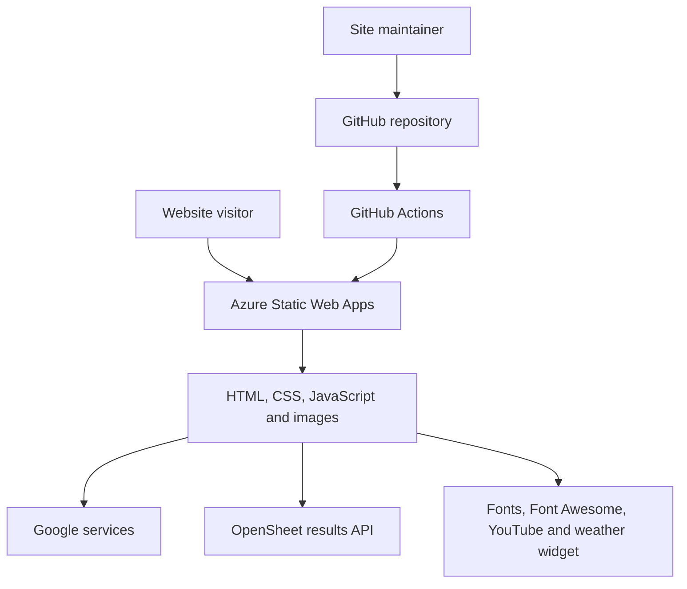
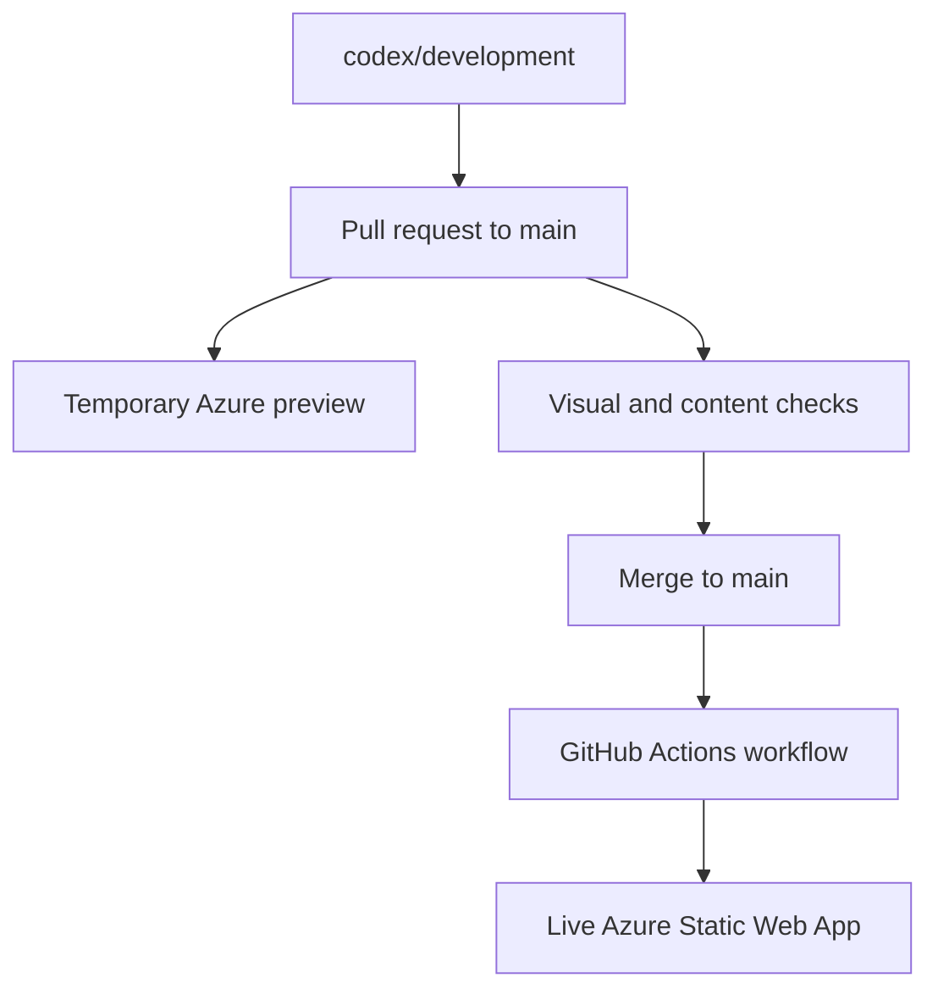

# System architecture

## Purpose and scope

This repository contains the public Blorenge Fell Race information site. It is a small static website: GitHub stores the source, GitHub Actions deploys it, and Azure Static Web Apps serves it. There is no server-side application or database in this repository.

## Context

## Deployment architecture

The workflow is `.github/workflows/azure-static-web-apps-ambitious-bay-0339ed203.yml`. Its production trigger is a push to `main`. Pull requests targeting `main` receive Azure preview deployments, and closing a pull request removes its preview.

The workflow uses:

- `app_location: /` — the repository root is the site root.
- Empty `api_location` — there is no Azure Functions API.
- Empty `output_location` — files are served directly; there is no compilation/build output.
- The repository secret `AZURE_STATIC_WEB_APPS_API_TOKEN_AMBITIOUS_BAY_0339ED203` — authenticates deployment to Azure. Its value is not stored in the source.

## Runtime data flows

Most content is committed directly in HTML. The important exception is `result.html`, which loads results in the visitor's browser:

1. Historical results are requested as JSON from OpenSheet, backed by a public Google Sheet.
2. 2025 results are requested as CSV from a published Google Sheet.
3. Browser JavaScript converts those responses into collapsible HTML tables.

If either external endpoint is unavailable, the page catches and logs the error, but does not show a visitor-facing fallback message.

Other third-party browser dependencies include Google Analytics (`G-82X36PHB8L`), Google Fonts, Font Awesome, YouTube, weatherwidget.io, What3Words, and published Google Docs/Forms.

## Routing

`routes.json` contains a catch-all rule that serves `/index.html` with HTTP 200 for unknown paths. Named pages are plain `.html` files. The navbar and footer are separate HTML documents embedded into every page with iframes.

## Security and privacy boundaries

- The site itself has no authentication and is publicly accessible.
- No application secrets are present in the browser code; deployment credentials remain in GitHub Actions secrets.
- Google Analytics and third-party embeds make browser requests outside Azure. Privacy/cookie behaviour should be reviewed when tracking or embeds change.
- Results data is public and client-rendered. Do not publish fields in the source sheets that should not be publicly retrievable.
- `main` currently has no repository ruleset. The development runbook therefore treats merge discipline as the protection against accidental production changes.

## Known architectural constraints

- Page layout and common metadata are duplicated across several HTML files.
- Navbar/footer iframe documents add layout and accessibility complexity and require an HTTP server during local testing.
- The site has no package manifest, automated tests, linting, link checker, or build validation.
- `routes.json` can hide missing-page errors by returning the homepage with status 200.
- Results depend on third parties at page-load time.
- The repository includes large original images and macOS `.DS_Store` files, increasing repository size.

