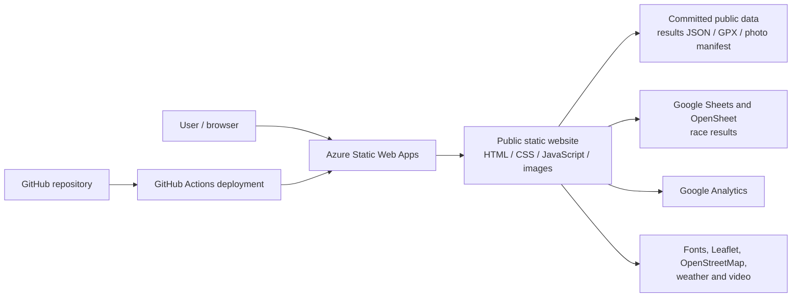

# Architecture

## Overview

The Blorenge Fell Race website is a static, browser-rendered site. Azure Static Web Apps serves HTML, CSS, JavaScript, and images directly. There is no application server, API, or database in this repository.

## Components

| Component | Location | Responsibility |
|---|---|---|
| Home | `index.html` | Event summary, location, and community and environmental content |
| Information | `info.html` | Travel, kit, race information, images, and statistics |
| Route | `route.html` | Confirmed route narrative, interactive/static maps, images, and GPX download |
| Entry | `enter.html` | Publishes confirmed entry facts and registration availability |
| Results | `result.html` | Loads and presents current and historical published results |
| Privacy | `privacy.html` | Public privacy information and contact details |
| Shared navigation and footer | `components/` | Common page navigation and footer content |
| Styling | `style*.css` and component CSS | Layout, responsive presentation, tables, route, and winner styling |
| Behaviour | `script.js`, `route-map.js`, `photo-manager.js`, and inline scripts | Page interaction, route map, photo assignment, results rendering, analytics, and public embeds |
| Public data | `data/public/`, `data/photos/`, and `downloads/` | Normalized results, editorial photo catalogue, and the public route GPX |
| Media | `images/` | Logos, static maps, source photographs, and generated display photographs |

## Data flow

- General event content, the confirmed route GPX, the photo manifest and display images are committed as static files.
- The current entry page does not activate a registration service; it will link or embed the confirmed public service when entries open.
- Results are loaded in the visitor's browser from published Google Sheets and OpenSheet endpoints.
- The interactive route map uses Leaflet and OpenStreetMap tiles; the route description and GPX remain available if either external resource fails.
- Google Analytics receives website usage events from the browser.
- Public contact links open the visitor's email application; the website does not send email itself.

The repository contains no server-side payment, email, database, or storage implementation. The JSON photo manifest and generated images are repository files, not a separate media service.

The unlinked registration prototype has local and Azure-preview simulations plus a separate, stable Azure development environment for shared synthetic testing. The latter uses managed Functions, Entra organiser access and isolated Table storage. None is a production registration service; production remains closed and has no registration API or private data store.

## Deployment flow

GitHub stores the source. GitHub Actions publishes reviewed website versions to Azure Static Web Apps. Pull-request previews provide a separate URL for checking proposed changes before production approval.

Detailed operational and security review information is maintained separately from the public website.
