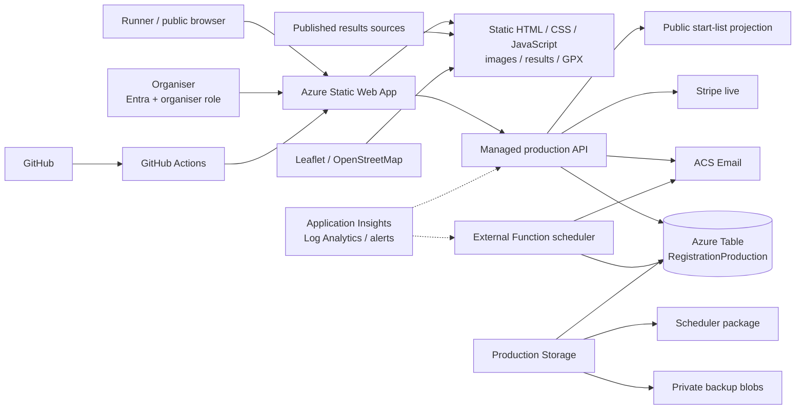

# Current architecture

Last verified: 26 September 2026. For operating procedures, use the [registration operations handbook](operations/README.md).

## Overview

The Blorenge Fell Race site combines a static public website and production registration browser application with an Azure Static Web Apps managed Functions API. Registration data is stored privately in Azure Table Storage. Stripe provides live Checkout/refunds and authoritative signed events; Azure Communication Services sends transactional email. A separate Azure Function handles 30-minute scheduled work. Microsoft Entra/Static Web Apps protects organiser operations.

```mermaid
flowchart LR
    U[Runner / public browser] --> SWA[Azure Static Web App]
    O[Organiser<br/>Entra + organiser role] --> SWA
    SWA --> STATIC[Static HTML / CSS / JavaScript<br/>images / results / GPX]
    SWA --> API[Managed production API]
    API --> TABLE[(Azure Table<br/>RegistrationProduction)]
    API --> STRIPE[Stripe live]
    API --> ACS[ACS Email]
    API --> LIST[Public start-list projection]
    SCHED[External Function scheduler] --> TABLE
    SCHED --> ACS
    STORE[Production Storage] --> TABLE
    STORE --> BACKUPS[Private backup blobs]
    STORE --> PACKAGE[Scheduler package]
    MON[Application Insights<br/>Log Analytics / alerts] -.-> API
    MON -.-> SCHED
    GH[GitHub] --> ACTIONS[GitHub Actions] --> SWA
    RESULTS[Published results sources] --> STATIC
    MAPS[Leaflet / OpenStreetMap] --> STATIC
```

## Components

| Component | Responsibility |
|---|---|
| Static public pages | Race information, route, GPX, photographs, results, privacy and content |
| Registration browser pages | Order of up to five runners, Checkout return, management, declaration and start list |
| Organiser dashboard | Authenticated entry/refund/transfer/declaration/race-number/invitation operations |
| Managed production API | Validation, state enforcement, ETag transactions, provider integration and public projection |
| `RegistrationProduction` | Authoritative private event state in partition `blorenge-2026-live` |
| Stripe | Hosted live payment, webhook truth and refunds |
| ACS Email | Transactional runner messages and secure links |
| External scheduler | Waiting-list/declaration reminders and reservation/offer/order expiry every 30 minutes |
| Storage blobs | Private backups, Functions host metadata and scheduler deployment package |
| Monitoring | Application Insights, Log Analytics, ACS diagnostics, alert rules/action group |
| GitHub Actions | Validates exact artifacts and deploys the Static Web App/managed API from `main` |

## Registration data flow

The runner browser never receives storage credentials and cannot choose price/state. The API validates the order, calculates £6 standard or £4 WFRA price, and reserves capacity when Checkout starts. Stripe sends signed events to the webhook; the API reconciles those events before confirming payment/place. The browser return page only reads server state.

Private runner, contact, emergency, declaration, secure-token, payment-operational and audit data remain in production storage. The public start list returns only the current confirmed runner's permitted public fields. Results archives remain separate public data sources.

Payment and declaration are independent. A paid runner may require declaration completion. Email delivery failure does not undo payment or registration. Scheduled expiry/reminders are asynchronous; submissions, Checkout creation, webhooks, refunds and organiser changes are synchronous.

## Public content services

- General content, normalized 2025 results, GPX, photo manifest and generated images are committed public files.
- Historical/published result sources may use Google Sheets/OpenSheet.
- Route display uses Leaflet/OpenStreetMap; committed route facts/GPX remain available if tiles fail.
- Existing analytics and public embeds run in the browser.

## Deployment and data separation

The production workflow creates an allowlisted application/API artifact; repository docs, infrastructure, tests, fixtures, private files and development controls are excluded. A merge to `main` deploys application code but does not normally modify production registrations or operational state. The external scheduler package is validated/staged by the workflow but deployed separately.

Production and development have separate Static Web Apps, storage accounts, tables/partitions, Stripe modes, ACS controls and schedulers. Development accepts synthetic data only. See [environments](operations/environments.md).
