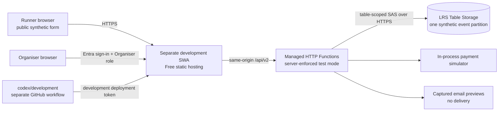

# Registration Phase 2 Azure approval pack

Status: awaiting explicit organiser approval. No Azure deployment command has been run, no resource has been created, and the production Static Web App is not referenced by this proposal.

Prepared: 3 September 2026. Pricing is the Microsoft public GBP retail price, not a subscription-specific quote.

## Decision summary

Provision one isolated development resource group containing only:

| Item | Proposed exact name | Region | Tier |
|---|---|---|---|
| Resource group | `rg-blorenge-registration-dev-weu` | West Europe | No charge |
| Static Web App and managed HTTP Functions | `swa-blorenge-registration-dev` | West Europe | Free |
| StorageV2 account | `stblorengeregdev2026` | West Europe | Standard LRS, pay per use |
| Table | `RegistrationDevelopment` | Storage account | Standard LRS |
| Event partition | `blorenge-2026-test` | Table | One synthetic partition |
| Resource-group cost budget | `budget-blorenge-registration-dev-gbp1` | Resource-group scope | £1/month alert |

The names require a read-only availability check before deployment. If either global name is unavailable, stop and agree the replacement rather than silently choosing another. Tags on both billable resources are `project=blorenge-fell-race`, `workload=registration`, `environment=development`, `dataClassification=synthetic-only`, and `managedBy=bicep`.

Explicitly excluded: a standalone Function App or plan, Application Insights, Log Analytics, private endpoints, backup containers, premium/always-on compute, extra roles, payment services, mail services, Marketplace products and any production resource.

## Architecture and boundaries



The public network boundary contains the generated development HTTPS hostname, runner assets and only the deliberately public `/api/v2` status, submit, confirmation and payment-simulation operations. The organiser page and all `/api/v2/organiser/*` operations require `Organiser`. Static Web Apps route rules provide the first check; each Function must also decode the platform-provided principal and require the role. An authenticated user without `Organiser` remains denied.

The Storage Table endpoint is necessarily public because Free managed Functions have neither managed identity nor a fixed private network path. It accepts HTTPS only and is not called by browsers. The only application credential is a revocable SAS scoped to `RegistrationDevelopment` with read, add, update and delete permissions. It is held in the Static Web App's encrypted API settings. Account keys, SAS values, deployment tokens and notification addresses must never be committed, logged, shown in reports or placed in frontend JavaScript.

This is a synthetic-development boundary, not a production security design. A separate Function App with managed identity may be reconsidered before real data only if its additional security and operational cost are approved.

## Authentication flow and access lifecycle

1. A runner uses the public form without authentication. The API ignores client-selected state, fixes the environment to development/test, applies capacity/idempotency controls and rejects any address outside the approved synthetic example-domain rule.
2. An organiser selects sign in and is sent to the preconfigured Microsoft Entra endpoint `/.auth/login/aad`.
3. Static Web Apps accepts the identity but grants the custom `Organiser` role only after a specific, short-lived invitation has been accepted.
4. Route rules protect the dashboard and organiser API. Managed Functions receive the platform principal header and independently verify `authenticated` plus `Organiser` before accessing private data.
5. Grant access with one invitation for one nominated address, expiring within 24 hours. Do not create an Entra user, group, app secret or additional application role.
6. Remove access in Static Web App **Role Management** by deleting that user's role assignment. Removal invalidates permissions but may take several minutes to propagate. Verify with a private browser session. The CLI can list and update users, but Portal deletion is the least ambiguous removal operation and is therefore proposed here.

The preconfigured Entra provider permits any Microsoft account to authenticate, but authentication alone grants no organiser access. Invitations are acceptable for this Free synthetic environment; tenant-restricted custom authentication requires the Standard plan and is deliberately excluded.

## Secrets and identity decision

Managed identity is not available to Static Web Apps managed Functions. The approved target therefore cannot combine managed Functions with managed-identity Table access. The least-privilege substitute is:

- one stored access policy named `swa-api-v2` on the one Table;
- one SAS limited to that table and `raud` operations, with a finite expiry;
- the SAS token in an encrypted Static Web App API setting;
- non-secret settings for storage account name, table name, event partition, environment and forced registration state;
- rotation by replacing the policy expiry/SAS setting, testing, then invalidating the previous policy;
- immediate revocation by deleting or expiring the policy.

The GitHub workflow needs a deployment token for the new development Static Web App. Store it in the repository environment `registration-development`, not in source, under the name shown in the proposed workflow. It must be a token belonging to the new development app, never the existing production token.

## Subscription and spending-limit gate

The repository and current machine provide no authenticated Azure CLI, subscription metadata or billing connector. Consequently the subscription offer, available credit, spending-limit state, permission to create budgets, provider registrations and remaining Free Static Web App quota are **not confirmed**. Deployment is blocked until a read-only check confirms them.

The check must record privately (not in Git): subscription display name, state, offer/quota identifier, `subscriptionPolicies.spendingLimit`, resource providers, existing Free Static Web App count, Cost Management budget support and whether the proposed global names are available. A spending limit depends on the Azure offer; it must not be inferred from the existence of credits.

## Cost calculation

Microsoft's public Retail Prices API returned these West Europe GBP rates on 3 September 2026:

- Static Web Apps Free: £0 recurring charge; managed Functions are included. The Free plan includes 100 GB/month bandwidth and does not offer paid bandwidth overage.
- Standard LRS Table capacity: £0.0331 per GB-month.
- Standard LRS Table read, write, batch-write, list, scan and delete operations: £0.0003 per 10,000 transactions.
- Same-region service traffic and inbound transfer: assumed £0 for this design. Internet responses use the Static Web App allowance.
- Microsoft Entra preconfigured authentication and invitation roles: no new Azure resource or proposed recurring meter.
- GitHub Actions: expected to fit the repository/account's existing allowance; its allowance cannot be confirmed from Azure.

Calculation assumptions are deliberately conservative: 16 KiB aggregate Table capacity per registration (all normalized entities and indexes), and up to ten Table transactions per API request.

| Scenario | Stored capacity | Capacity cost | Transactions | Operation cost | Exact modelled Azure monthly total |
|---|---:|---:|---:|---:|---:|
| 110 registrations only | 0.001678 GB | £0.0000555 | — | — | £0.0000555 |
| 1,000 registrations only | 0.015259 GB | £0.0005051 | — | — | £0.0005051 |
| 10,000 API requests | — | — | 100,000 | £0.0030000 | £0.0030000 |
| 110 registrations + 10,000 requests | 0.001678 GB | £0.0000555 | 100,000 | £0.0030000 | £0.0030555 |
| 1,000 registrations + 10,000 requests | 0.015259 GB | £0.0005051 | 100,000 | £0.0030000 | £0.0035051 |

Every proposed Azure billable meter is therefore Table capacity and Table operations. There is no unavoidable recurring base charge. Actual invoicing can differ by agreement, rounding, taxes and price changes.

There is no honest finite hard-cost maximum because a public endpoint and pay-per-operation Table service cannot be capped by the £1 budget. The server will cap stored test registrations at 1,000, limit request bodies, rate-limit public mutations and avoid unbounded scans. A conservative abuse/stress envelope of **1,000,000 API requests/month**, ten transactions each, plus 1 GB stored is **£0.3331/month** at these rates. Traffic beyond the Free Static Web App allowance should be unavailable rather than billed as bandwidth overage, but an attack or leaked storage credential could exceed the model before an alert arrives. If a hard cap is required, this architecture is not sufficient and deployment must remain blocked.

The £1 monthly budget sends actual-cost email notifications at £0.50 and £1.00 if resource-group budgets are supported by the subscription. Azure evaluates cost data periodically; cost data commonly lags usage. The alert neither disables resources nor prevents further charges.

## Data reset, deletion and rollback

The organiser reset action requires `Organiser`, an explicit confirmation phrase and server-side development/test assertions. It pages through only partition `blorenge-2026-test`, deletes its entities in valid Table batches, recreates the event seed and returns verified zero counts. It does not delete the table or affect another partition.

Infrastructure removal is intentionally simple: revoke organiser access, invalidate the stored access policy, remove the development workflow secret, disable/remove the development workflow, and delete only `rg-blorenge-registration-dev-weu`. There is no backup in this phase, so deletion permanently discards synthetic data. Production is not a rollback target and is never modified.

If deployment or acceptance fails: stop the development workflow, revoke the SAS policy, remove the development deployment secret, then delete the named development resource group. Existing PR #8 and its current browser-only preview continue independently.

## Exact review artifacts and workflow diff

- `infrastructure/registration-development/main.bicep`: exact resource template; two Azure resources plus one child Table, nothing else.
- `infrastructure/registration-development/budget.bicep`: exact optional £1 resource-group budget.
- `infrastructure/registration-development/parameters.example.json`: exact non-secret parameters.
- `infrastructure/registration-development/azure-static-web-apps-registration-development.proposed.yml`: exact proposed new workflow content.

The workflow diff after approval is one new file only:

```text
/dev/null
  -> .github/workflows/azure-static-web-apps-registration-development.yml
```

Its content will be copied unchanged from the `.proposed.yml` artifact. It triggers only for `codex/development` (or manual dispatch), uses a different development deployment secret, validates before deployment and targets the new app. It has no `main` trigger, pull-request trigger, production app name, production hostname, production secret or custom-domain operation. The existing production workflow remains byte-for-byte unchanged.

Before activating the workflow, the implementation must add the managed Functions wrapper in `api/`, its exact lockfile, Azure Table adapter, development-specific Static Web Apps routes, server-enforced test policy and automated cloud-boundary tests. The workflow must not be activated while `api/` is absent.

## Commands proposed after approval

The following is the complete command sequence. Placeholders are supplied interactively and outputs containing identifiers or credentials are not copied into reports. **None has been run.**

Read-only subscription and availability gate:

```sh
az login
az account show --query '{name:name,state:state,quotaId:subscriptionPolicies.quotaId,spendingLimit:subscriptionPolicies.spendingLimit}' --output json
az provider show --namespace Microsoft.Web --query registrationState --output tsv
az provider show --namespace Microsoft.Storage --query registrationState --output tsv
az provider show --namespace Microsoft.Consumption --query registrationState --output tsv
az staticwebapp list --query '[].{name:name,resourceGroup:resourceGroup,sku:sku.name}' --output table
az storage account check-name --name stblorengeregdev2026 --query nameAvailable --output tsv
az group exists --name rg-blorenge-registration-dev-weu
```

The Static Web App name is checked with an Azure Resource Manager read-only request or Portal before proceeding because CLI support varies. Stop if providers, Free quota, names, budget support or permissions are unsuitable.

Resource what-if and creation, only after a second explicit go-ahead on the verified output:

```sh
az group create --name rg-blorenge-registration-dev-weu --location westeurope --tags project=blorenge-fell-race workload=registration environment=development dataClassification=synthetic-only managedBy=bicep
az deployment group what-if --resource-group rg-blorenge-registration-dev-weu --template-file infrastructure/registration-development/main.bicep --parameters infrastructure/registration-development/parameters.example.json
az deployment group create --resource-group rg-blorenge-registration-dev-weu --template-file infrastructure/registration-development/main.bicep --parameters infrastructure/registration-development/parameters.example.json
az deployment group what-if --resource-group rg-blorenge-registration-dev-weu --template-file infrastructure/registration-development/budget.bicep --parameters startDate=<YYYY-MM-01T00:00:00Z> endDate=<YYYY-MM-01T00:00:00Z> alertEmail=<private-alert-address>
az deployment group create --resource-group rg-blorenge-registration-dev-weu --template-file infrastructure/registration-development/budget.bicep --parameters startDate=<YYYY-MM-01T00:00:00Z> endDate=<YYYY-MM-01T00:00:00Z> alertEmail=<private-alert-address>
```

Table policy/SAS and encrypted API settings (shell variables prevent values being printed; command history and debug output must remain off):

```sh
AZURE_STORAGE_ACCOUNT_KEY="$(az storage account keys list --resource-group rg-blorenge-registration-dev-weu --account-name stblorengeregdev2026 --query '[0].value' --output tsv)"
az storage table policy create --account-name stblorengeregdev2026 --account-key "$AZURE_STORAGE_ACCOUNT_KEY" --name RegistrationDevelopment --policy-name swa-api-v2 --permissions raud --expiry <UTC-EXPIRY>
REGISTRATION_TABLE_SAS_TOKEN="$(az storage table generate-sas --account-name stblorengeregdev2026 --account-key "$AZURE_STORAGE_ACCOUNT_KEY" --name RegistrationDevelopment --policy-name swa-api-v2 --https-only --output tsv)"
az staticwebapp appsettings set --resource-group rg-blorenge-registration-dev-weu --name swa-blorenge-registration-dev --setting-names "REGISTRATION_STORAGE_ACCOUNT=stblorengeregdev2026" "REGISTRATION_TABLE=RegistrationDevelopment" "REGISTRATION_EVENT_PARTITION=blorenge-2026-test" "REGISTRATION_ENVIRONMENT=development" "REGISTRATION_STATE=test" "REGISTRATION_TABLE_SAS_TOKEN=$REGISTRATION_TABLE_SAS_TOKEN"
unset REGISTRATION_TABLE_SAS_TOKEN
unset AZURE_STORAGE_ACCOUNT_KEY
```

Deployment token, workflow and organiser access:

```sh
az staticwebapp secrets list --resource-group rg-blorenge-registration-dev-weu --name swa-blorenge-registration-dev --query properties.apiKey --output tsv | gh secret set AZURE_STATIC_WEB_APPS_API_TOKEN_REGISTRATION_DEVELOPMENT --env registration-development
git diff --no-index /dev/null infrastructure/registration-development/azure-static-web-apps-registration-development.proposed.yml
git push origin codex/development
az staticwebapp show --resource-group rg-blorenge-registration-dev-weu --name swa-blorenge-registration-dev --query '{hostname:defaultHostname,sku:sku.name}' --output json
az staticwebapp users invite --resource-group rg-blorenge-registration-dev-weu --name swa-blorenge-registration-dev --authentication-provider AAD --user-details <private-organiser-address> --roles Organiser --domain <generated-development-hostname> --invitation-expiration-in-hours 24
az staticwebapp users list --resource-group rg-blorenge-registration-dev-weu --name swa-blorenge-registration-dev --authentication-provider AAD --output table
```

The current machine has neither Azure CLI nor GitHub CLI installed, so approved execution would use Azure Cloud Shell plus the GitHub environment UI, or separately approved tool installation. The workflow file itself will be added with the repository editing process, not by an unreviewed shell copy.

Rollback/deletion commands, to be run only after a separate destructive-action confirmation:

```sh
az storage table policy delete --account-name stblorengeregdev2026 --account-key <private-account-key> --name RegistrationDevelopment --policy-name swa-api-v2
az staticwebapp appsettings delete --resource-group rg-blorenge-registration-dev-weu --name swa-blorenge-registration-dev --setting-names REGISTRATION_TABLE_SAS_TOKEN
gh secret remove AZURE_STATIC_WEB_APPS_API_TOKEN_REGISTRATION_DEVELOPMENT --env registration-development
az group delete --name rg-blorenge-registration-dev-weu --yes --no-wait
```

## Approval gate

Do not provision or activate anything until the organiser has reviewed this pack and explicitly approved both the architecture and the command sequence. Approval must also supply privately: the intended Azure subscription, confirmation of its offer/spending-limit result, an alert address, the organiser account to invite, acceptance of invitation-based Entra access, and acceptance that the £1 alert is not a cap.

## Authoritative references

- [Azure Static Web Apps plans](https://learn.microsoft.com/azure/static-web-apps/plans)
- [Static Web Apps quotas](https://learn.microsoft.com/azure/static-web-apps/quotas)
- [Managed Functions capabilities and managed-identity limitation](https://learn.microsoft.com/azure/static-web-apps/apis-functions)
- [Static Web Apps authentication and authorization](https://learn.microsoft.com/azure/static-web-apps/authentication-authorization)
- [Static Web Apps user principal passed to Functions](https://learn.microsoft.com/azure/static-web-apps/user-information)
- [Static Web Apps API application settings](https://learn.microsoft.com/azure/static-web-apps/application-settings)
- [Static Web Apps invitation role commands](https://learn.microsoft.com/cli/azure/staticwebapp/users)
- [Table Storage pricing](https://azure.microsoft.com/en-gb/pricing/details/storage/tables/)
- [Azure Cost Management budgets](https://learn.microsoft.com/azure/cost-management-billing/costs/tutorial-acm-create-budgets)
- [Budget Bicep resource reference](https://learn.microsoft.com/azure/templates/microsoft.consumption/2023-11-01/budgets)
