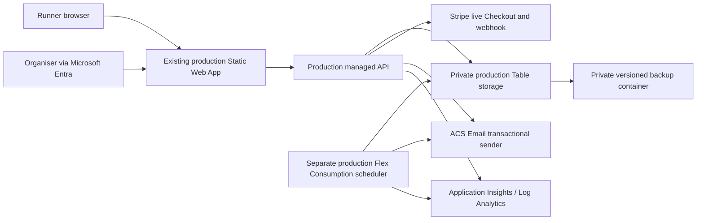

# Phase 3C.0 production-readiness audit

Status: audited design; no production deployment authorised. Registration remains feature-frozen.

## Decision

The Phase 3B behaviour is suitable as the basis for production, but the current deployable code is intentionally development-only. A Phase 3C.1 engineering change is required before any CLOSED production deployment. In particular, the API and scheduler entry points reject every environment except `development` / `test`, the production artifact still excludes all registration files, the production state-transition API is not wired, production email delivery has no adapter, and production backup/alert resources are not defined.

The first production deployment must therefore be a reviewed CLOSED infrastructure-and-application deployment, not a configuration switch on the development build. It must not accept entries or take payments.

## Audited application behaviour

- Prices are server-authoritative: £6.00 standard and £4.00 for a self-declared WFRA member with a required membership number. The applied per-runner price and reason are persisted. Browser amounts are ignored. Tested totals are £6, £4, £12, £10 and £8.
- Orders contain one to five runners. Draft runners can be added, edited and removed. Capacity is reserved atomically only at Checkout; an expired Checkout is recoverable but must revalidate price and capacity.
- Every active runner email is currently unique, including for a 16- or 17-year-old. Confirm whether a guardian may need to share an address before launch.
- An adult must type their own name and confirm that they personally completed the declaration. A runner aged 16 or 17 has no signatory dropdown: a parent/legal guardian is clearly required, provides their full name, and is persisted with the distinct `Parent / Legal Guardian` role. Immediate and emailed follow-up completion are covered.
- Payment confirmation is driven only by a verified Stripe webhook. Return-page navigation cannot mark an order paid. Event processing and provider operations are idempotent.
- Secure order, management, invitation and declaration tokens are opaque; only hashes are stored. Runner URLs carry the token in the fragment where practical.
- Amendments, transfers, refund requests, organiser refund decisions/execution, cancellation, race-number actions, waiting-list progression, declaration handling and scheduled expiry/reminders are covered by tests.
- The public start list is built as a new allowlisted projection. It includes only paid, confirmed, current runners and only name, optional club, category and optional race number. Pending declarations remain visible; drafts, reservations, waiting-list records, cancelled/refunded/replaced runners and private fields do not.

## Communication audit

| Journey | Automatic communications |
|---|---:|
| Signed and paid single runner | one confirmation |
| Deferred declaration | initial combined confirmation/request, then at most one automatic reminder |
| Routine amendment | none |
| Transfer | one to previous runner and one to replacement runner |
| Refund | request acknowledgement and one final outcome; approval itself sends nothing |
| Waiting list | join, offer and at most one reminder |
| Abandoned Checkout | none |

A multi-runner payment additionally sends one concise purchaser summary after the per-runner confirmations. Recovery and explicit organiser resend actions send a message only when requested and are not automatic lifecycle chatter. There is no future-marketing field, consent or subscription feature.

## Target production architecture

Use the existing production Static Web App and custom domain. Create all registration data and scheduler resources separately from development, preferably in a dedicated production resource group in West Europe. Never share the development table, partition, ACS resource, scheduler, app settings or Stripe account mode.

### Required production resources

1. Existing production Static Web App, with its SKU decision recorded. Free has no SLA; Standard is the supported general-purpose production tier and adds a fixed monthly cost. The CLOSED deployment can be prepared without changing the custom domain.
2. A separate Standard_LRS StorageV2 account with HTTPS only, TLS 1.2 minimum, public blob access disabled, and narrowly scoped access.
3. One private Azure Table (proposed logical name `RegistrationProduction`) and one event partition (proposed `blorenge-2026-live`). The current small-event persistence model is a single compressed, ETag-protected state entity. Its logical collections are: event/state, runners, emergency contacts, registrations, orders, payments, declarations, consents, order/declaration/management/invitation token hashes, waiting-list entries/offers, refunds, communications/idempotency receipts, audit events and scheduler status.
4. A private blob container for versioned application backups and a private Function deployment package container.
5. A production ACS resource plus Email Communication Service in the Europe data location, linked to a verified sender domain.
6. A separate production Azure Functions Flex Consumption app, zero always-ready instances, 512 MB instance size and a monitored 30-minute timer.
7. A production Log Analytics workspace and workspace-based Application Insights resource, with 30-day operational retention initially.
8. An Azure Monitor action group and focused alerts; a subscription/resource-group cost budget with 50%, 80% and 100% notifications.

### Identity and roles

- Static Web Apps route role: exactly lowercase `organiser`. The server normalises the principal roles and maps this to its internal `Organiser` permissions. Protect `/registration/dashboard.html`, `/api/v3/organiser/*` and `/api/v4/organiser/*` in `staticwebapp.config.json`; every organiser API also authorises the `x-ms-client-principal` server-side.
- Invite only named organisers through Microsoft Entra/Static Web Apps role management. Hidden URLs are never authorization. Review and remove access after the event.
- Managed Static Web Apps Functions currently require a revocable, table-scoped SAS because managed identity was not proven for this hosting model. Store it only as a Static Web App application setting. Prefer a bring-your-own Functions design only if its extra complexity/cost is separately approved.
- The production scheduler uses a system-assigned managed identity. Grant only Storage Table Data Contributor on the production store, the minimum Blob/Queue permissions required by the Functions host/package deployment, the minimum ACS email sending role supported by the resource, and Monitoring Metrics Publisher where required. Do not copy development role assignments by identity.

## CLOSED bootstrap and state controls

On the first read of an absent production partition, atomically create exactly one schema-versioned state entity containing:

- environment `production`;
- operational state `CLOSED`;
- capacity 120;
- £600 standard and £400 WFRA member prices;
- zero runners, registrations, orders, payments, declarations, reservations, waiting-list entries/offers, refunds and communications.

An existing entity must never be overwritten by bootstrap. Missing, malformed, wrong-environment or unsafe state must return a service-unavailable/closed response and alert; it must not be silently recreated as OPEN. A deployment must not alter operational state.

Production transitions remain `CLOSED → PRIVATE_LIVE or OPEN or CLOSED_FINAL`, `PRIVATE_LIVE → CLOSED/OPEN/PAUSED/CLOSED_FINAL`, `OPEN → PAUSED/CLOSED_FINAL`, and `PAUSED → CLOSED/PRIVATE_LIVE/OPEN/CLOSED_FINAL`. Phase 3C.1 must expose a server-authorised organiser action that requires the expected current state, confirmation, and audit record. There is currently no wired production action, so this is a deployment blocker. No environment variable, date, URL or deployment is an opening control.

## Stripe live design

Required production settings (names only):

- `REGISTRATION_ENVIRONMENT=production`
- `REGISTRATION_PUBLIC_BASE_URL=https://www.blorengefellrace.cymru`
- `STRIPE_ENABLED`
- `STRIPE_SECRET_KEY`
- `STRIPE_WEBHOOK_SIGNING_SECRET`

The webhook endpoint is `POST /api/v3/stripe/webhook`. It consumes `checkout.session.completed`, `checkout.session.async_payment_succeeded`, `checkout.session.async_payment_failed`, `checkout.session.expired`, `charge.refunded` and `refund.failed`. The raw body and `Stripe-Signature` are mandatory. Configure those events only, use one production webhook endpoint, and store its signing secret in Static Web Apps application settings. No secret belongs in Git, output, logs or browser code.

Phase 3C.1 must add a production provider factory that rejects test keys and requires live credentials when enabled; the existing development factory already rejects live keys. Initially deploy CLOSED with Stripe disabled. Configure live credentials and the signed endpoint only during an approved controlled gate before PRIVATE_LIVE. A key being present must not enable Stripe by itself.

## ACS Email production design

Required production settings (names only):

- `ACS_EMAIL_ENABLED`
- `ACS_EMAIL_ENDPOINT` or, only if managed identity is unavailable, `ACS_EMAIL_CONNECTION_STRING`
- `REGISTRATION_EMAIL_SENDER`

Do not set `REGISTRATION_EMAIL_SAFE_RECIPIENTS` in production. Phase 3C.1 must use a production adapter that sends only reviewed transactional templates to the intended recipient; it must never import the development redirect adapter. If delivery fails, retain authoritative registration/payment state, keep the durable idempotency key eligible for controlled retry, surface an operational error and alert. Email failure must never roll back or duplicate a verified Stripe reconciliation.

Choose a sender such as a dedicated subdomain of the race domain. In Azure, create and link an Email Communication Service domain; in DNS add the exact ownership TXT plus SPF and two DKIM records Azure provides, wait for all checks to verify, then configure an approved MailFrom sender. DNS values and credentials are operational records, not repository content.

## Production scheduler

Create a production copy of the proven timer app, not a mode change to the development Function. It runs `0 */30 * * * *`, uses Azure's monitored timer lock, calls shared idempotent domain logic directly, and has no public application endpoint. Production code must require `REGISTRATION_ENVIRONMENT=production`, reject controlled-clock settings, and read the stored operational state; it must not require or set `REGISTRATION_STATE=test`.

The scheduler processes expired Checkout reservations, the single declaration reminder, waiting-list offer reminder/expiry/progression and configured retention/backup work. It must be safe in CLOSED with no work. `REGISTRATION_SCHEDULER_ALLOW_TEST_TIME`, `REGISTRATION_SCHEDULER_TEST_NOW` and every development safe-recipient setting are forbidden.

## Production artifact allowlist

Current production: exactly 45 staged files (28 fixed public files, 16 manifest-approved generated photos, and generated `staticwebapp.config.json`). No registration or API exists.

Phase 3C.1 target composition must be generated from an explicit allowlist and reviewed as two roots:

- Static app: the existing 45 files plus only the production runner, declaration, payment return, management, start-list and organiser-dashboard HTML/CSS/module dependency graph, and a production route configuration.
- API: `package.json`, lockfile, the Azure Functions entry point, production storage/provider adapters, and only the shared v3/v4 domain/service modules they import.

Before that allowlist is final, separate production browser validation/client code from `registration-core.mjs` and `prototype-client.mjs`, because those files contain development/test behaviour. The production API must not register v2 test routes. The exact staged file list and count must become a locked test assertion; an unexpected file must fail deployment.

Always exclude repository root deployment, `.github`, `.DS_Store`, environment/config secrets, docs (including this file), infrastructure source, scripts, tests, fixtures, local stores/backups/exports, `registration/server` browser paths, source maps, logs, spreadsheets, package metadata from the static root, and all unused modules.

## Development-only exclusions

Production entry points must fail closed when any of the following are requested or configured: Reset test; v2 mock payment, synthetic import, controlled clock, local organiser bypass, fixture loading, safe-recipient redirection, captured test communications, Stripe test keys, `registrationState=test`, development partitions, development invitation helpers and development scheduler controls. Production must also reject an environment mismatch in persisted state.

The existing production artifact test proves the current 45-file boundary. Phase 3C.1 must extend it to prove both the new production allowlist and all exclusions above.

## PRIVATE_LIVE preparation

Do not create invitations during Phase 3C.1. Once CLOSED deployment, real-provider configuration, backups, monitoring and external checks pass, an organiser may explicitly transition CLOSED to PRIVATE_LIVE and create small, purpose-bound, expiring, revocable, limited-use invitation URLs. PRIVATE_LIVE uses the same production database, live payment, email, capacity, pricing and declaration rules as OPEN. The token only authorises access; it never bypasses current state, expiry, capacity or validation.

## Retention, backup and restore

Retention configuration must be data-class specific without changing the current entities: short-lived emergency contacts removed shortly after the event when incident needs end; address data retained only for the documented environmental/carbon analysis and then removed/anonymised; contact data not reused for marketing; public result fields retained historically; financial payment/refund/audit evidence retained under the organiser's seven-year record policy. Before live use, the organiser must approve exact durations for abandoned drafts, waiting-list records, addresses/contact fields, declarations and token/audit metadata.

Azure Table Storage has no suitable point-in-time restore for this single-state design. Add an application-level backup operation that writes the complete compressed state plus schema version, source ETag, timestamp and checksum into a private, versioned blob container. Recommended schedule: before every state-changing release or bulk organiser operation; automatic daily backup while registration is active; pre-launch; immediately before PRIVATE_LIVE/OPEN; and pre-race. Keep 35 daily copies and 13 monthly operational copies. Create a separate minimised financial archive for the seven-year evidence rather than retaining all runner/emergency data for seven years.

Restore procedure: force CLOSED; disable the production scheduler and public writes; record the incident; export and preserve the damaged current state; select and checksum-verify a backup; restore only with an ETag/maintenance guard; run invariants and compare Stripe payment/refund records; smoke-test read paths; re-enable scheduler; remain CLOSED until approved. Rehearse once with synthetic production-like data before PRIVATE_LIVE. An encrypted private organiser CSV is useful for race-day continuity, but it is not authoritative for orders, Stripe reconciliation or refunds.

## Monitoring and alerts

Use one small Application Insights/Log Analytics workspace with privacy-minimal structured events and 30-day operational retention. Never log form bodies, email addresses, tokens, secrets, addresses, dates of birth or webhook payloads.

Alert an organiser on: repeated/any sustained API 5xx; invalid or repeatedly failing Stripe webhook processing; payment amount/currency/capacity reconciliation failure; approved refund execution failure; ACS delivery failure after retry; scheduler failure or no successful run for more than 75 minutes while active; capacity invariant breach; waiting-list progression failure; backup failure; or stored state/environment/schema validation failure. A single ordinary validation 4xx, declined card or invalid/expired secure link does not need an alert. Keep Stripe Dashboard webhook delivery alerts enabled as an independent signal.

## Rollback

1. Immediately use the authenticated state action to return to CLOSED when available; otherwise apply the documented emergency write-disable setting that can only close, never open.
2. Disable the production scheduler if its code is implicated. Leave the Stripe webhook endpoint reachable if the deployed version can safely reconcile events; otherwise use Stripe endpoint disablement only after recording the time and queueing provider events for replay.
3. Redeploy the last known compatible frontend/API artifact. Do not restore the old 45-file public-only artifact until a plan exists for payment webhooks and runner management links already issued.
4. Schema changes must be additive/backward-readable for at least one release. Never roll back by deleting/reinitialising the production table.
5. Preserve registrations, payments, idempotency records and audit events. Reconcile Stripe before reopening. Never generate automatic refunds as part of rollback and never retry a refund without its persisted idempotency identity.
6. Restore from backup only for confirmed data corruption, using the procedure above, then remain CLOSED for review.

## Cost estimate at 120-runner scale

The existing Static Web App Free tier has no incremental fixed hosting charge but no SLA; Standard introduces a fixed app charge and should be quoted in the Azure calculator before approval. Table/blob storage and transactions should be pennies to low single pounds per month at this data volume. A zero-always-ready 30-minute Flex timer is about 1,488 executions in a 31-day month, well within the subscription-level Flex free grant if it is available; host storage remains usage-priced. A few hundred ACS emails should be well below £1 at ordinary per-email/data rates. Application Insights is likely within the first 5 GB/month free ingestion allowance, but caps and privacy-minimal sampling are still required.

Expected incremental Azure spend is approximately £0–£3/month while using the existing Free Static Web App and free grants, or that amount plus the current Standard Static Web App fixed charge if upgraded. Actual billing depends on subscription-wide grant use, region, exchange rate, email volume and log volume. Stripe processing/refund fees and DNS/domain costs are separate. A low monthly budget alert is appropriate; do not provision a premium database, always-ready Functions, Front Door or a large monitoring commitment for this event without a new decision.

Pricing references: [Azure Static Web Apps](https://azure.microsoft.com/en-gb/pricing/details/app-service/static/), [Azure Functions](https://azure.microsoft.com/en-gb/pricing/details/functions/), [Azure Table Storage](https://azure.microsoft.com/en-us/pricing/details/storage/tables/), [Azure Communication Services](https://azure.microsoft.com/en-gb/pricing/details/communication-services/), and [Azure Monitor](https://azure.microsoft.com/en-us/pricing/details/monitor/).

## Phase 3C.1 gates

Phase 3C.1 may be planned and implemented on a feature branch, but a production CLOSED deployment is **not yet safe**. Required gates are:

1. Build production-specific API, storage, Stripe and ACS entry points; remove v2/test routes.
2. Wire the authenticated, optimistic-concurrency state transition action without allowing deployments to change state.
3. Build and lock the exact production static/API artifact allowlist and prove development-only exclusions.
4. Add the production Bicep/parameters with separate identities, storage, ACS, scheduler, monitoring, alert, budget and backup resources; review the SWA Free-versus-Standard decision.
5. Confirm the exact WFRA requirement for entrants aged 16 or 17 and approve all declaration/terms/privacy wording.
6. Approve retention durations, sender/domain, organiser list, support/alert destination, live Stripe account/statement details and backup retention.
7. Run all tests, dependency/secret/artifact scans; deploy CLOSED; verify empty state and 404/403 boundaries; then perform a separately approved synthetic/non-payment smoke test.

No Phase 3C.1 resource provisioning, production deployment, provider enablement, invitation creation or state transition occurred during this audit.
