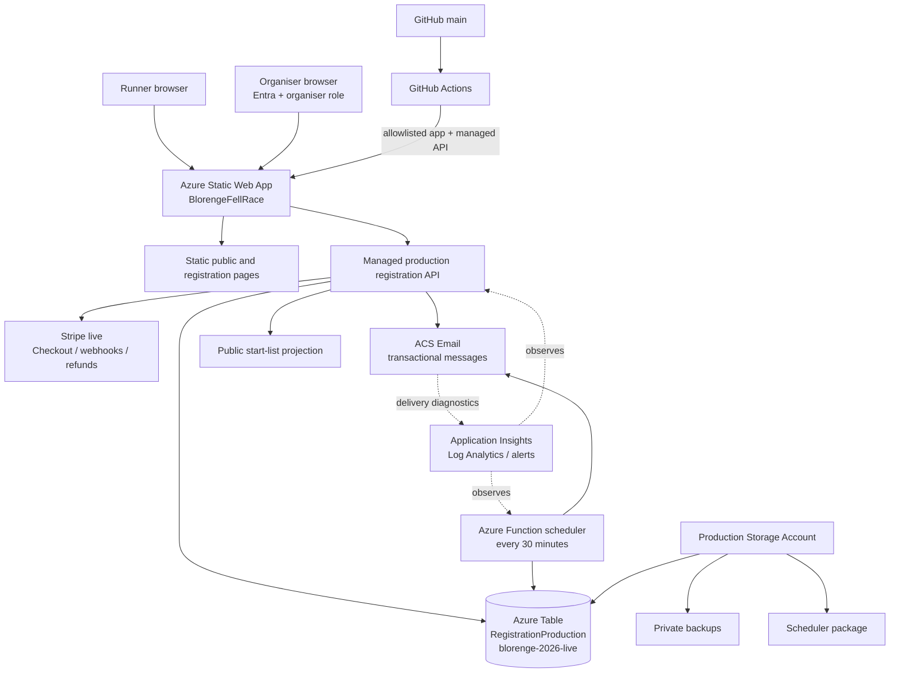

# System overview

## What has been built

The production system combines a public static website and runner registration pages with a managed Azure Functions API. The API keeps the authoritative registration state in one production Azure Table partition, creates Stripe Checkout sessions, verifies Stripe webhooks, sends transactional email through Azure Communication Services (ACS), and supplies a privacy-minimised public start list.

An external Azure Function runs background work every 30 minutes. Organiser operations are protected by Microsoft Entra authentication and the Static Web Apps custom role `organiser`. GitHub Actions validates and deploys an exact allowlisted Static Web Apps application/API artifact from merged `main` commits.

## Synchronous flows

- Page and asset requests are served by the Static Web App.
- Order creation, runner validation, capacity reservation and Checkout creation run during the runner request.
- Stripe sends signed events to `/api/v3/stripe/webhook`; server reconciliation confirms or releases places.
- Organiser edits, transfers, state changes, refund decisions and race-number actions use authenticated API calls.
- Application-triggered email asks ACS to send and stores a privacy-limited delivery receipt. Email failure does not undo a valid payment, refund or registration.
- The start list is calculated from current paid/confirmed registration state and exposes only public fields.

## Asynchronous flows

- Stripe completion is authoritative only after a valid webhook is reconciled; the browser redirect only reads server state.
- The external scheduler runs every 30 minutes to expire stale Checkout reservations and waiting-list offers, send waiting-list reminders/offers, send one due declaration reminder, and abandon configured stale drafts.
- ACS delivery/status diagnostics arrive in Log Analytics after the send attempt.
- Azure alert rules evaluate every five minutes.
- GitHub Actions runs after pull-request activity for validation and after a push to `main` for production Static Web App deployment.

## Data boundaries

Private runner/order/payment metadata lives in `RegistrationProduction`, partition `blorenge-2026-live`; it is not committed to Git. Stripe retains provider payment/refund records. The public start list is a read-only minimised projection, not a second database. Backup blobs are private. GitHub holds source, tests and infrastructure definitions but no production runner records or secret values.

Development uses separate Azure resources, a different Table and partition, Stripe test mode and controlled email. See [environments](environments.md).
