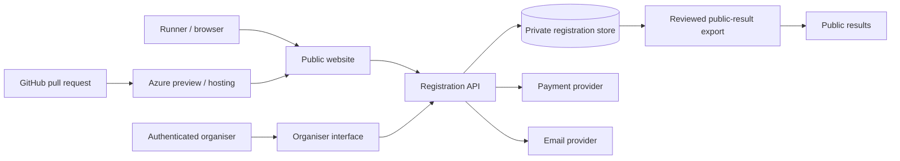

# Registration prototype architecture

## Current position

The public website is static and the 2026 entry page is informational. A previous Google Form remains in commented source for historical reference, but it is not displayed or described as the 2026 registration service. Published race results use separate public spreadsheet/JSON sources. The repository does not establish which private response spreadsheet or payment process supported the earlier form, so those details must be confirmed with the organiser rather than inferred.

The previous form, any private response spreadsheet and any manual payment reconciliation could be replaced incrementally: first by an isolated registration API and private store, then by payment and email adapters, and finally by an authenticated organiser interface. Public results must remain a separate, reviewed export.

## Phase 1 recommendation

Use the existing Azure Static Web App for public pages, with a separately deployed API, private data store and authenticated organiser application when production work is approved. Keep payment and email behind provider-neutral adapters. Do not give the public website direct storage credentials.

Phase 1 implements the original domain rules and Azure-preview simulation. Phase 2 adds a versioned server API and persistent repository behind the same user journey. The Azure PR preview continues using its isolated browser simulation; the separate approved development Static Web App uses managed Functions, Microsoft Entra organiser access and one Azure Table for shared synthetic testing. Neither environment is suitable for real entries. See `adr/0001-registration-storage.md` and `registration-phase2.md`.

Preview records persist across navigation and refresh in the same browser profile. A `storage` event refreshes an organiser tab after a runner submission in another tab; normal page refresh also reloads the same repository. Private/incognito windows have separate storage, another browser or device cannot see the records, and clearing site data removes them. Corrupt or outdated stored data blocks mutation and displays one reset instruction instead of silently discarding or accepting data.

## State enforcement

The state model is `closed`, `test`, `open`, `paused` and `full`.

- `closed` rejects submissions before validation and stores nothing.
- `test` is limited to localhost, numbered Azure preview hostnames and the isolated stable development hostname. It accepts only obviously synthetic email addresses; only the stable development host uses shared Azure storage.
- `open` is implemented in the domain model for future server tests, but production converts every requested non-closed state to `closed`. The test dashboard cannot select it.
- `paused` retains existing records and rejects new submissions.
- `full` rejects direct submissions. The final production waiting-list policy still requires organiser approval. The prototype demonstrates a provisional first-in waiting list when test capacity is exceeded.

A query parameter, browser preference or date cannot change the production state. Production has no registration API in Phase 1, so a direct API request cannot store data or trigger another service.

Reset removes every preview registration and returns the accepted and waiting-list counts to zero. Automated synthetic fixtures remain available to the test suite but are not loaded into the organiser’s manual journey. Every runner-created record carries a visible test reference.

Race numbers remain unique while assigned. An organiser can remove a number explicitly, or choose whether to release it when cancelling an entry; the cancellation choice defaults to release. A refund does not alter the entry's race number because payment and entry validity are separate decisions. Assignment and removal are recorded in the prototype audit history.

## Data model

| Entity | Principal fields |
|---|---|
| Event | Opaque ID, name, race date, capacity, minimum age, environment |
| Runner | Opaque ID, name and private contact/race-day details |
| Registration | Opaque ID, event and runner IDs, entry state, timestamps |
| Entry status | Accepted, waiting list, cancelled; waiting-list position |
| Payment | Mock status only: not started, successful, declined, abandoned, refunded |
| Consent | Terms version, privacy version, recorded timestamp |
| Audit event | Opaque ID, event type, timestamp, affected registration |
| Communication | Opaque ID, template type, captured preview, delivery state |
| Race allocation | Optional race number, unique within the event |

Email addresses are attributes, never database keys. Public results remain logically and physically separate from registration data.

## Capacity and concurrency

The prototype uses one authoritative state mutation path, so only one of two final-place requests can receive the last accepted place. A production database should enforce this in a transaction or conditional write using an event-capacity counter and unique request/idempotency key. The automated suite exercises entries 109, 110 and 111 plus simultaneous final-place requests.

## Production resources still requiring approval

- an Azure-hosted registration API;
- a private transactional data store with backup and recovery;
- an identity provider and role-based organiser access;
- monitoring and operational alerts;
- approved payment and transactional-email providers;
- separate development and production configuration and data boundaries.

The Phase 2 cloud resources are development-only and synthetic-only. Detailed operational and security review information is maintained separately from the public website.

## Phase 3A production-readiness foundation

Phase 3A adds a separate server domain for production operational states, purpose-bound private invitations revalidated on every protected operation, capacity reservations, waiting-list offers, versioned WFRA declaration evidence, private self-declared WFRA membership evidence, server-calculated pricing, secure management links, cutoff-aware amendments, refund decisions and optional race numbers. UK Athletics affiliation and membership number are not part of the active model because they are not required for current race registration or operations. Production initialization is always `CLOSED`, and the existing deployment allowlist still excludes all registration pages and APIs. The development service remains synthetic with mock payment and captured-only email adapters. See `registration-phase3-plan.md` for implemented boundaries and the provider work still requiring approval.

Phase 3B adds a disabled-by-default integration layer for Stripe-hosted test Checkout, raw-body signed webhooks, idempotent reconciliation, full sandbox refunds, controlled ACS Email delivery and a server-authoritative runner payment-status page. Stripe and external email are independently enabled and otherwise fail closed. It does not alter the production artifact. See `registration-phase3b.md` for the payment/email state machines, scheduled-work boundary and remaining provider proof gates.

Phase 3B.3 separates a purchaser order, its one-to-five individual registrations, one combined payment and each runner's declaration state. Draft orders reserve no capacity; Checkout reserves every place atomically or none. A secure order link recovers an unpaid order in a fresh browser, reuses one still-valid Checkout, and revalidates price, runner data and capacity before replacing an expired Checkout. Payment and declaration are independent: a paid confirmed runner may still require a declaration, but cannot be marked cleared to start until it is complete. Each adult retains their own email, secure management link and declaration link. Group payments support registration-specific partial refunds. Runner and explicit organiser transfers preserve payment/place history but revoke the previous ownership links and declaration, with post-cutoff organiser override recorded separately. Final WFRA confirmation of the declaration and race-day process remains a launch-readiness requirement.
