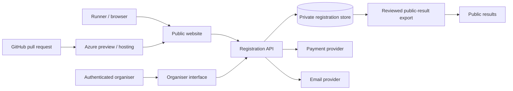

# Registration prototype architecture

## Current position

The public website is static and the 2026 entry page is informational. A previous Google Form remains in commented source for historical reference, but it is not displayed or described as the 2026 registration service. Published race results use separate public spreadsheet/JSON sources. The repository does not establish which private response spreadsheet or payment process supported the earlier form, so those details must be confirmed with the organiser rather than inferred.

The previous form, any private response spreadsheet and any manual payment reconciliation could be replaced incrementally: first by an isolated registration API and private store, then by payment and email adapters, and finally by an authenticated organiser interface. Public results must remain a separate, reviewed export.

## Phase 1 recommendation

Use the existing Azure Static Web App for public pages, with a separately deployed API, private data store and authenticated organiser application when production work is approved. Keep payment and email behind provider-neutral adapters. Do not give the public website direct storage credentials.

Phase 1 implements the domain rules and an in-memory local API. The Azure PR preview uses an isolated browser simulation because no cloud API or database is being provisioned. That simulation is for usability review only and is not suitable for real entries or organiser access.

## State enforcement

The state model is `closed`, `test`, `open`, `paused` and `full`.

- `closed` rejects submissions before validation and stores nothing.
- `test` is limited to localhost and numbered Azure preview hostnames. It accepts only obviously synthetic email addresses and uses local, disposable data.
- `open` is implemented in the domain model for future server tests, but production converts every requested non-closed state to `closed`. The test dashboard cannot select it.
- `paused` retains existing records and rejects new submissions.
- `full` rejects direct submissions. The final production waiting-list policy still requires organiser approval. The prototype demonstrates a provisional first-in waiting list when test capacity is exceeded.

A query parameter, browser preference or date cannot change the production state. Production has no registration API in Phase 1, so a direct API request cannot store data or trigger another service.

## Data model

| Entity | Principal fields |
|---|---|
| Event | Opaque ID, name, race date, capacity, minimum age, environment |
| Runner | Opaque ID, name and private contact/race-day details |
| Registration | Opaque ID, event and runner IDs, entry state, timestamps |
| Entry status | Accepted, waiting list, cancelled; waiting-list position |
| Payment | Mock status only: not started, successful, declined, abandoned, refunded |
| Consent | Terms version, privacy version, recorded timestamp |
| Audit event | Opaque ID, event type, timestamp, affected registration |
| Communication | Opaque ID, template type, captured preview, delivery state |
| Race allocation | Optional race number, unique within the event |

Email addresses are attributes, never database keys. Public results remain logically and physically separate from registration data.

## Capacity and concurrency

The prototype uses one authoritative state mutation path, so only one of two final-place requests can receive the last accepted place. A production database should enforce this in a transaction or conditional write using an event-capacity counter and unique request/idempotency key. The automated suite exercises entries 109, 110 and 111 plus simultaneous final-place requests.

## Future Azure resources requiring approval

- an Azure-hosted registration API;
- a private transactional data store with backup and recovery;
- an identity provider and role-based organiser access;
- monitoring and operational alerts;
- approved payment and transactional-email providers;
- separate development and production configuration and data boundaries.

No cloud resource is created by Phase 1. Detailed operational and security review information is maintained separately from the public website.
