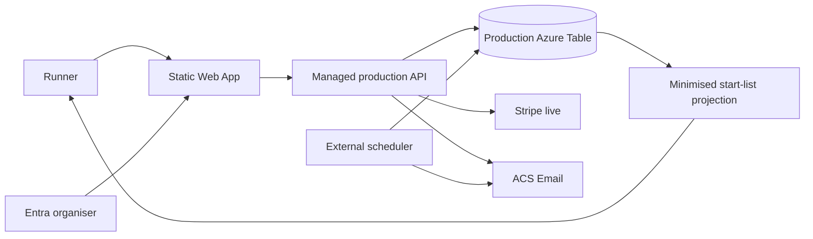

# Registration architecture

> **Current production reference.** Earlier Phase 1/2/3 planning and prototype documents are historical records. For live operation use [docs/operations/](operations/README.md).

## Current position

Production registration is deployed and currently uses `PRIVATE_LIVE`. It is not a browser-only prototype. The public/runner pages call a managed Azure Static Web Apps API. The authoritative event state is persisted in Azure Table `RegistrationProduction`, partition `blorenge-2026-live`, with ETag-guarded whole-state transactions. Stripe live and ACS Email are enabled; a separate Function scheduler performs 30-minute background work. Organiser APIs require Microsoft Entra sign-in plus literal role `organiser`.

```mermaid
flowchart LR
    R[Runner] --> WEB[Static Web App]
    O[Entra organiser] --> WEB
    WEB --> API[Managed production API]
    API --> DB[(Production Azure Table)]
    API --> PAY[Stripe live]
    API --> MAIL[ACS Email]
    S[External scheduler] --> DB
    S --> MAIL
    DB --> PROJ[Minimised start-list projection]
    PROJ --> R
```

## Operational state and access

The production states are `CLOSED`, `PRIVATE_LIVE`, `OPEN`, `PAUSED` and terminal `CLOSED_FINAL`. They are server-side persisted state. A date, URL parameter, app setting or deployment cannot open registration. `PRIVATE_LIVE` requires an opaque, purpose-bound, expiring invitation for new entry; `OPEN` permits public entry. Existing management/declaration flows remain distinct.

The authenticated transition endpoint requires the expected current state and exact confirmation text and records an audit event. The current dashboard displays state but does not expose a state-transition button.

## Orders, capacity and providers

One order contains one to five registrations and one combined Stripe Checkout. Drafts reserve nothing. Checkout atomically reserves every runner place or none. Capacity is confirmed registrations plus active payment reservations plus active waiting-list offer reservations, never above 120. Stripe signed webhooks—not the return page—confirm payment. Individual registrations in a group retain separate declaration, transfer and partial-refund lifecycles.

Server pricing is £6 standard or £4 for a self-declared WFRA member with membership number. Payment and declaration are separate; a paid place may still require declaration completion. Junior entry is currently disabled.

ACS sends significant transactional messages with idempotency keys. The external scheduler expires stale Checkout/offer state and sends due waiting-list/declaration messages. The public start list is generated from current paid/confirmed entries and never includes private contacts, declarations, tokens, payment internals, waiting-list or audit data.

## Data and recovery

Runner/order/payment-operational state is private and separate from Git/deployment. Production storage also has a private `registration-backups` container with versioning and 35-day soft deletion. Snapshot creation/validation is currently a controlled manual operation; automatic daily backup execution is not wired/verified in the deployed scheduler artifact. Direct Table editing is never normal operation.

## Production/development boundary

The stable development environment uses separate `RegistrationDevelopment` storage/partition, Stripe test mode, controlled/captured email and its own scheduler. Production artifacts physically exclude synthetic fixtures, browser local-storage repository, mock-payment/reset routes, local bypass and development scheduler controls.

## Historical documents

Phase documents under `docs/registration-phase*.md` and `docs/internal/` explain how the system evolved. Statements in them such as “production remains CLOSED”, “resources are proposed”, or “no production API” describe a past gate, not the current system. Preserve them as decision/audit history but do not use them as live operating instructions.
