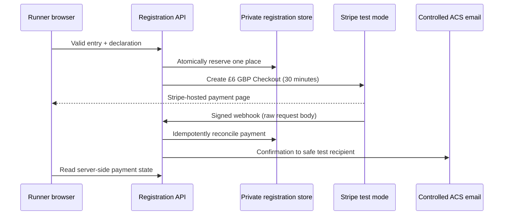

# Phase 3B — controlled payments and communications

## Status

The provider-neutral implementation is complete on the Phase 3 feature branch. It remains disabled unless the isolated development runtime is explicitly configured. Live provider proof and stable-development deployment are pending organiser-controlled Stripe and Azure setup; production is unchanged.

No Stripe live key is accepted in development. No email is delivered to a runner-supplied address. Missing provider configuration fails closed.

## Payment architecture

The server calculates the expected price and creates a Stripe-hosted Checkout Session. Card data remains on Stripe. Standard entry is £6 GBP. The configurable WFRA member price remains unset, so members and non-members both pay £6 until the organiser approves a discount. Tests inject a member price to prove that browser-supplied amounts are ignored and the adjustment is auditable.

Checkout reservations last 30 minutes. Capacity includes confirmed entries, active payment reservations and active waiting-list offers. Expiry or asynchronous failure releases the reservation. A successful webhook confirms it. A browser return URL never marks an entry paid.

Payment evidence includes the internal registration/payment reference, test-mode Checkout Session identifier, relevant PaymentIntent identifier, expected amount, actual paid amount, GBP currency, timestamps, refund state and webhook reconciliation state. Card/CVC/payment-method details and unnecessary billing information are excluded. Provider identifiers stay out of public status responses.

### Webhook security and reconciliation

`/api/v3/stripe/webhook` receives the raw, unmodified request body and `Stripe-Signature`. The official Stripe SDK verifies it against runtime-only signing configuration before JSON is trusted. Invalid signatures and tampered bodies fail closed. Provider event IDs are retained for idempotency; duplicate delivery has no second effect. Amount/currency mismatches never confirm an entry.

Supported lifecycle events are Checkout completion, Checkout expiry, asynchronous success/failure, completed refund and failed refund. Confirmed payment has terminal precedence over a later expiry event. A late paid event after released capacity has already been reallocated is flagged for manual review instead of allowing capacity above 120.

### Refund state

Runner request → organiser approval/rejection → Stripe full-refund request → server reconciliation → place release. Normal requests remain subject to the 28 October 2026 23:59 Europe/London cutoff; an exceptional organiser action remains audited. A failed refund does not release the place. Partial refunds, admin fees and retained processing charges are not implemented.

## Controlled development email

Sixteen English templates cover payment, entry management, refunds and waiting-list events. Template data is provider-neutral so selective Welsh content can be introduced later without redesigning delivery.

The development adapter has two modes:

- With an approved sender, ACS authentication and a non-empty safe-recipient allowlist, every message is redirected to the configured safe recipient(s). The intended synthetic runner address appears only inside the test message.
- Without complete safe delivery configuration, the adapter captures the message and makes no external call.

Safe recipients and provider credentials are runtime configuration only. Actual addresses are neither committed nor returned in API responses. Management and offer tokens may appear in their intended email or one-time creation response, but not in logs or audit payloads.

The preferred production authentication is a managed identity with the minimum ACS email role. The current managed Static Web Apps Functions environment has not been proven to support that identity model. Phase 3B therefore supports either `DefaultAzureCredential` with an endpoint or an ACS connection string held only in isolated runtime secret configuration. No service-plan or hosting migration should be made solely for managed identity without a separate cost/architecture approval.

## Waiting-list and scheduled work

The queue retains first name, last name and email only. An offer reserves capacity for 48 hours and becomes reminder-eligible after 24 hours. Decline/expiry releases it and progresses to the next eligible person. Offer tokens remain hashed and are revalidated for purpose, revocation, expiry and use before acceptance or payment.

The domain exposes one idempotent scheduled-work operation for reminder detection, offer expiry/progression and stale payment reservations. A low-frequency authenticated trigger is sufficient for a 120-person race. Reliable scheduling in the current managed Static Web Apps Functions topology is not yet confirmed; moving hosting or adding a paid scheduler requires separate approval.

## Runtime configuration names

Values belong only in isolated development runtime settings:

- `REGISTRATION_PHASE3B_ENABLED`
- `REGISTRATION_PUBLIC_BASE_URL`
- `STRIPE_SECRET_KEY`
- `STRIPE_WEBHOOK_SIGNING_SECRET`
- `REGISTRATION_EMAIL_SAFE_RECIPIENTS`
- `REGISTRATION_EMAIL_SENDER`
- `ACS_EMAIL_ENDPOINT` or `ACS_EMAIL_CONNECTION_STRING`

The existing storage settings remain required. The browser has no live/test selector.

## Release gates and progression

Phase 3B cannot be called complete until a real Stripe test Checkout/webhook/refund and one redirected ACS delivery have been observed in the isolated stable development environment. The stable environment must then be manually checked at capacity 120 with Entra-protected organiser operations. Until then, the integration flag remains disabled and `codex/development` remains unchanged.

The planned progression is:

`Phase 3B — controlled integrations` → `Phase 3C — production infrastructure/application deployed CLOSED` → `Phase 3D — private live pilot with real Stripe and real email` → `Public OPEN`

The WFRA member price and the WFRA parental-consent process for entrants aged 16 or 17 remain unresolved launch decisions. Under-18 entrants remain blocked before Checkout.
